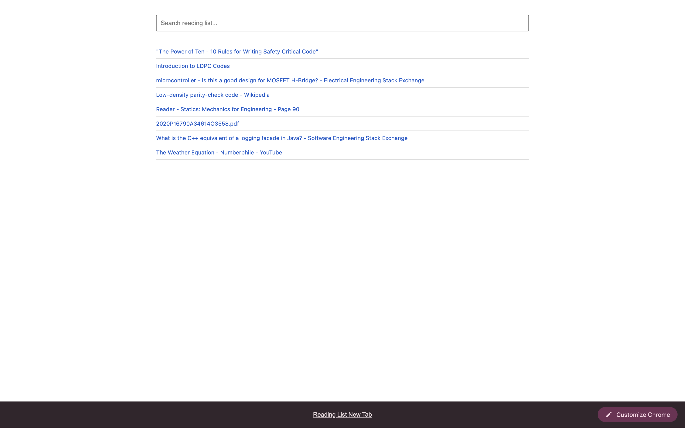

# Reading List New Tab

Manifest V3 Chrome extension. Overrides the default new tab page to render the `chrome.readingList` data array. Implements O(n) client-side string matching for filtering items.

## Generation Prompt:
> "Build the simplest extension possible for Chrome, that takes the items from reading list (as in https://developer.chrome.com/docs/extensions/reference/api/readingList), then shows them as a searchable list in the new tab. Show only that in the tab."

## Interface

## Installation Protocol

1. Access `chrome://extensions/` in the browser.
2. Enable **Developer mode**.
3. Execute **Load unpacked**.
4. Target the local directory containing `manifest.json`.

## Technical Specifications

- **Permissions Required:** `readingList`
- **Overrides:** `chrome_url_overrides.newtab`
- **Manifest Version:** 3